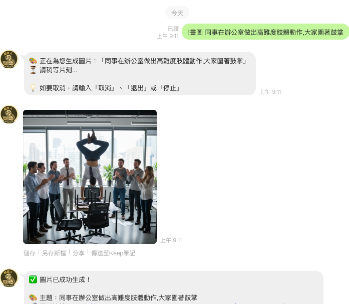

# Line Bot with GPT Integration

## 示範機器人 Demo Line Bot

直接點選連結 加入 Line Bot 後使用

https://liff.line.me/1645278921-kWRPP32q/?accountId=728wsrjq





## 目錄 (Table of Contents)

- [Line Bot with GPT Integration](#line-bot-with-gpt-integration)
  - [示範機器人 Demo Line Bot](#示範機器人-demo-line-bot)
  - [目錄 (Table of Contents)](#目錄-table-of-contents)
  - [專案簡介 (Project Introduction)](#專案簡介-project-introduction)
  - [功能 (Features)](#功能-features)
    - [圖片生成功能](#圖片生成功能)
  - [文檔指南 (Documentation Guide)](#文檔指南-documentation-guide)
    - [📚 主要文檔](#-主要文檔)
    - [🔧 技術文檔](#-技術文檔)
    - [📖 快速導航](#-快速導航)
      - [🚀 新手入門](#-新手入門)
      - [🎨 圖片生成功能](#-圖片生成功能)
      - [🐳 Docker 部署](#-docker-部署)
      - [⚙️ 進階設定](#️-進階設定)
    - [💡 使用建議](#-使用建議)
  - [安裝與執行 (Installation and Running) (方法1)](#安裝與執行-installation-and-running-方法1)
  - [環境變數 (Environment Variables)](#環境變數-environment-variables)
  - [安裝與執行 (Installation and Running) (方法2)](#安裝與執行-installation-and-running-方法2)
  - [專案結構 (Project Structure)](#專案結構-project-structure)
    - [📁 重要檔案說明](#-重要檔案說明)
    - [🎯 設定檢查清單](#-設定檢查清單)


## 專案簡介 (Project Introduction)

此專案是一個基於 [LINE Messaging API](https://developers.line.biz/en/docs/messaging-api/) 的 Line Bot，並整合了 [OpenAI GPT-4o](https://openai.com/) 來處理用戶的對話內容。

This project is a Line Bot based on the [LINE Messaging API](https://developers.line.biz/en/docs/messaging-api/), integrated with [OpenAI GPT-4o](https://openai.com/) to handle user conversations.

## 功能 (Features)

- 🤖 **LLM 自主長文發布引擎 (David888 Wiki)**：當使用者要求深入分析、研究報告、系統架構或完整教學時，LLM 自主生成完整 Markdown 文章發布至 Wiki，並回傳摘要與 3 合 1 閱讀模式（網頁、2D 簡報、電子書）
- 🗂️ **現代化 Session 多話題管理與 7 天長效持久化記憶 (`session_helper.js`)**：
  - 🔄 **7 天自動話題生命週期**：7 天內對話脈絡持續延續，超過 7 天未發言則背景自動開啟全新話題 Session。
  - 💾 **磁碟原子持久化 (`./data/sessions.json`)**：伺服器重啟或 Docker / Watchtower 自動部署皆不遺失歷史話題。
  - ⚡ **話題管理指令**：支援 `/new`（開啟新話題）、`/sessions`（瀏覽歷史話題）、`/session <id>`（切換話題）、`/clear`（清空當前記憶）。
- 🧠 **網址自動預先解析與零延遲注入 (Smart URL Pre-Fetching)**：主動偵測訊息中的外部連結與 Wiki 分享文章，自動直抓純淨 Markdown 內文注入上下文，杜絕 AI 幻覺
- 🌐 **2MD 即時聯網搜尋與網頁解析 (SERP & Web Reader)**：三端點高可用容錯（Primary: `2md.aiurl.tw`，Fallback: `2md.glsoft.ai`, `create360.ai`），支援 OpenAI Tool Calling (`search_web`, `read_web_page`, `read_wiki_note`)
- 📦 **888box 雲端多媒體資產庫**：三端點高可用容錯（Primary: `box.david888.com`，Fallback: `box.glsoft.ai`, `box.aiurl.tw`），支援 AI 圖片/影片/檔案自動 CDN 存儲與 Podcast 訂閱
- 整合 OpenAI 相容端點與 Groq `openai/gpt-oss-120b` 高階模型（具備多輪 Agentic Tool Execution Loop）
- 整合 Google Gemini 2.5/3.1 Flash AI 視覺功能
  - 🔍 **圖片分析**：上傳圖片讓 AI 分析內容（看圖說話）
  - ✏️ **圖片編輯**：基於現有圖片進行 AI 編輯
  - 🎨 **文字生成圖片**：從文字描述生成全新圖片（自動上傳 888box CloudFront CDN）
- 🎤 **語音辨識 (ASR)**：支援 Groq Whisper 和 Gemini ASR，自動轉錄語音並用 GPT 回應
- 🛠️ **線上工具集**：整合 tool.david888.com 實用工具網站
- 解答之書占卜服務（精美 Flex Message 呈現）
- 唐詩隨機推薦（精美 Flex Message 呈現）
- 淺草籤占卜（精美 Flex Message 呈現）
- 奇門遁甲占卜（精美 Flex Message 呈現）
- 台灣氣象署天氣特報
- ⚖️ **台灣法律諮詢**：整合台灣法律專業 LLM，長篇法律意見書自動發布至 Wiki
- 📍 **周邊設施查詢**：傳送位置資訊，查找附近加油站、超商、餐廳、咖啡廳、停車場、ATM 等設施
- 🍲 **大同電鍋食譜助手**：使用 RAG 技術提供大同電鍋食譜查詢（支援繁體中文語義搜尋）
- 🚀 **自動化 CI/CD & Watchtower 部署**：GitHub Actions 自動建置 Multi-Arch 映像檔，伺服器 60 秒內自動無縫熱更新
- 支援群組聊天（需要 @ 機器人）

---

### 📖 David888 Wiki：LLM 自主長文發布與 3 合 1 閱讀體驗 (CORE FEATURE)

> [!IMPORTANT]
> **Wiki 的核心設計初衷是給「AI Agent / LLM」使用，而非繁瑣的人類手動輸入！**
> 在 LINE 狹窄的聊天視窗中閱讀數千字長文極不舒適且容易被字數限制截斷。因此，當使用者向 Bot 交代**「深入分析」、「研究報告」、「完整教學」、「多步驟方案」、「企劃書」、「架構設計」、「市場調研」**等複雜任務時，LLM 會自動撰寫結構優美的完整 Markdown 文章發布到 David888 Wiki，並在 LINE 回傳高質感的精華摘要卡片與專屬閱讀連結！

#### 🌟 核心特色：
1. **LLM Tool Calling (`publish_to_wiki`)**：LLM 能在回答過程中主動判定是否需要發布至 Wiki，並生成包含 `[TOC]` 目錄、Mermaid 流程圖、比較表格、代碼區塊與註腳的專業文章。
2. **智慧長文自動攔截 (Smart Auto-Publisher)**：若模型產出超過 600 字且含 Markdown 章節結構的深度分析，系統將自動攔截並發布至 Wiki，避免 LINE 訊息過長被分段或截斷。
3. **3 合 1 專屬閱讀模式**：
   - 🌐 **Web Reader**：公開唯讀頁面 (`https://wiki.david888.com/share/<id>`)，支援 20+ 款主題（如 `claude-canvas`, `tokyo-night`, `retro`）與字型自訂。
   - 📑 **2D Slide Deck 簡報模式**：網址後加上 `/present`，自動將文章轉為 Reveal.js 2D 簡報矩陣。
   - 📚 **eBook 電子書模式**：網址後加上 `/book`，提供雙欄目錄索引與左右拖曳閱讀。

#### 💡 使用範例：
- **使用者輸入**：`「幫我深入分析 2026 年邊緣運算與 Agent 架構的技術趨勢，並給出完整評估」`
- **Bot 回應**：
  - 發布完整文章至 David888 Wiki
  - LINE 收到精美 Flex 卡片：
    - 📖 **標題**：2026 邊緣運算與 Agent 架構深度評估
    - 📝 **執行摘要**：本文剖析了分散式邊緣 Workers、D1 混合儲存與 MCP 工具端點的整合實踐...
    - 🔘 `[ 🌐 閱讀 Wiki 完整文章 ]`
    - 🔘 `[ 📑 2D 簡報模式 ]` | `[ 📚 電子書模式 ]`

---

### 📦 888box 多端點雲端資產管理 (NEW!)

整合 `box.david888.com` 雲端多媒體儲存中心，支援三端點高可用容錯路由（Primary: `box.david888.com`，Fallback: `box.glsoft.ai`, `box.aiurl.tw`）：

1. **AI 圖片自動 CDN 儲存**：Gemini 生成與編輯之圖片，自動儲存至 888box 並轉為 WebP 格式，透過 AWS CloudFront CDN 高速分發。
2. **LINE 多媒體自動轉存**：
   - **🎬 傳送影片**：自動上傳 888box，回傳播放與分享卡片。
   - **📄 傳送檔案**：PDF、Word、壓縮檔自動備份至雲端。
   - **📸 傳送圖片**：選單新增「☁️ 存入 888box」按鈕。
3. **遠端轉存與 Podcast RSS**：
   - `!box <url>` / `!轉存 <url>` / `!下載 <url>`：轉存遠端檔案。
   - `!box podcast`：取得影片/音訊自動生成的 Podcast RSS 訂閱連結。
   - `!box stats` / `!box`：查看雲端空間資產統計。

---

### 🎤 語音辨識功能 (ASR)

讓 AI 幫你「聽懂語音」，自動轉錄並智能回應。

**使用方式：**
1. 在 LINE 中發送語音訊息給 Bot
2. Bot 自動轉錄語音內容
3. 將轉錄文字送給 GPT 處理
4. 回覆智能回應

**支援的 ASR 服務：**
- **Groq Whisper** (推薦，免費額度)
- **Gemini ASR** (使用 Gemini API)
- **OpenAI Whisper** (可選)

**範例：**
```
User: 🎤 [語音: "講個笑話"]
Bot: 🎤 您說：「講個笑話」
     
     從前從前有一隻程式設計師...
```

### 🗂️ 現代化 Session 多話題管理與 7 天持久化記憶 (Session Architecture)

> [!TIP]
> **支援獨立話題 Session、7 天記憶持續與磁碟持久化！**
> 告別死板的單次無記憶設計，每個使用者擁有獨立的多話題 Session 檔案（存儲於 `./data/sessions.json`），即使伺服器重啟或自動發布更新，記憶也不會遺失！

#### 💬 核心運作機制：
1. **7 天自動話題生命週期**：您在 7 天內的每一次發言（文字、語音、網址分析）都會持續累積在同一個話題中，隨時可以自然追問（例如「那第二點呢？」、「這篇寫得好不好？」）。
2. **7 天閒置自動歸檔**：若您超過 7 天未與機器人交談，系統會在您下一次傳送訊息時自動開啟全新 Session，避免過期話題干擾。
3. **智慧上下文壓縮 (Token Compaction)**：系統自動保持最近 16 輪對話與網址內文，兼顧長效記憶與模型 Token 最優化。

#### ⚡ 話題管理指令表：
| 指令 | 說明 | 範例 |
| :--- | :--- | :--- |
| `/new` 或 `!new` | **立即開啟全新話題 Session**（發送清爽 Flex 提示卡片） | `/new` 或 `開啟新話題` |
| `/sessions` 或 `!sessions` | **列出您的歷史話題清單**（含標題、訊息數、時間與切換按鈕） | `/sessions` 或 `查看話題` |
| `/session <id>` | **切換回指定的歷史話題**，繼續未完的討論 | `/session sess_xxxx` |
| `/clear` 或 `!clear` | **清空當前話題的歷史訊息**（保留話題 ID） | `/clear` 或 `清除記憶` |

---

### 🌐 2MD 即時聯網搜尋與網頁解析 (Real-Time SERP & Web Reader)

> [!TIP]
> **LLM 具備即時聯網瀏覽能力！不再受限於知識截止日期！**
> 整合 2MD 三端點高可用搜尋引擎（`2md.aiurl.tw`, `2md.glsoft.ai`, `create360.ai`），支援即時天氣、即時股價、最新新聞、網址解析與線上文件轉換。

**智能自動觸發 (Agentic Tool Calling)：**
- 當向 Bot 詢問任何時效性問題時（例如：「高雄鼓山天氣如何」、「台積電今日即時股價」、「最新重大新聞」、「解析這篇網址 https://...」），LLM 會主動呼叫 `search_web` 或 `read_web_page` 取得最新即時資訊後精準回答！

**手動指令：**
- `!search <關鍵字>` / `!搜尋 <關鍵字>` / `!google <關鍵字>`：直接執行 2MD 即時網路搜尋並回傳 Flex 卡片
  - 例：`!search 高雄市鼓山區天氣`
  - 例：`!search 台積電 今日股價`
- `!read <網址>` / `!讀取 <網址>` / `!2md <網址>`：直接將網址轉為 clean Markdown
  - 例：`!read https://example.com/news`

### 🛠️ 線上工具集

快速存取實用的開發者工具。

**使用方式：**
- 輸入「工具」、「tools」或「線上工具」

**包含工具：**
- 🕐 線上時鐘
- 🔑 UUID 產生器
- 🔐 Hash 加密工具
- 📝 Base64 轉換
- 🎨 顏色選擇器
- 更多工具請訪問 https://tool.david888.com

### 🔍 圖片分析功能

讓 AI 幫你「看圖說話」，分析圖片內容並回答問題。

**使用方式：**
1. 傳送圖片給 Bot
2. 輸入你的問題或直接點選「🔍 分析圖片」

**分析範例：**
- `這是什麼？` → AI 會描述圖片內容
- `這張照片是在哪裡拍的？` → AI 會根據場景推測地點
- `圖片裡有什麼？` → AI 會列出圖片中的物體
- `請描述這張圖片` → AI 會提供詳細描述

**自動觸發關鍵字：**
這是什麼、分析、看圖、描述、辨識、有什麼、what is、describe 等

### ✏️ 圖片編輯功能

基於現有圖片進行 AI 編輯，改變風格、背景或添加元素。

**使用方式：**
1. 傳送圖片給 Bot
2. 輸入編輯指令或點選「✏️ 編輯圖片」

**編輯範例：**
- `把背景改成海邊` → 更換圖片背景
- `改成卡通風格` → 轉換藝術風格
- `加上彩虹和雲朵` → 添加新元素
- `讓顏色更鮮豔` → 調整色調

**自動觸發關鍵字：**
編輯、修改、改成、變成、把...改、加上、背景、風格、edit、change 等

### 🎨 文字生成圖片功能 (UPDATED!)

從零開始，用文字描述生成全新圖片。**現已支援對話式互動！**

**使用方式：**
- **對話式生成** (推薦)：
  1. 輸入「畫圖」、「!畫圖」或「圖片生成」
  2. Bot 會引導你輸入圖片描述
  3. 輸入詳細的圖片描述
  4. Bot 自動生成圖片
  5. 可隨時輸入「取消」退出

**生成範例：**
```
User: 畫圖
Bot: 🎨 請描述您想生成的圖片：
     範例：
     • 一隻可愛的小貓在花園裡玩耍
     • 未來主義的城市景觀
     
User: 一隻貓在看星空
Bot: ✨ 即將為您生成圖片...
     [圖片生成]
```

### 📍 周邊設施查詢

想知道附近有哪些設施？傳送位置給機器人即可！

**使用方式：**
1. 輸入「選擇服務」→ 點選「📍 找附近設施」
2. 或直接點選 LINE 輸入框左側的 `+` 號 → 選擇「位置資訊」
3. 點擊「📍 分享我的位置」按鈕
4. 選擇想查找的設施類型

**支援查找類別：**
- ⛽ 加油站
- 🅿️ 停車場
- 🏪 超商
- ☕ 咖啡廳
- 🍴 餐廳
- 🏧 ATM

**特色功能：**
- 📍 位置資訊保留 30 分鐘，可重複查詢不同類型
- 🗺️ 以 Flex Message Carousel 展示最多 10 個附近地點
- 📊 包含評分、距離、營業時間等資訊
- 🔗 可直接開啟 Google Maps 導航

### 🍲 大同電鍋食譜助手

不知道怎麼用電鍋做菜？問問大同食譜助手！

**使用方式：**
1. 輸入「大同食譜」進入食譜模式
2. 直接輸入想做的料理名稱（例如：「蒸蛋」、「滷肉」、「紅燒牛肉」）
3. 輸入「退出」結束食譜模式

**技術特色：**
- 🤖 **RAG 技術**：使用 ChromaDB 向量資料庫 + OpenAI Embedding
- 🇹🇼 **繁體中文優化**：採用 OpenAI text-embedding-3-small 模型，對繁體中文語義理解極佳
- 📚 **豐富食譜庫**：包含 584 個大同電鍋官方食譜
- 🎯 **精準檢索**：能理解「蒸蛋」、「滷肉」等繁體中文詞彙的語義
- ⚡ **快速回應**：向量搜尋 + GPT-4o 生成，秒級回應

**查詢範例：**
- 「蒸蛋」→ 找到電鍋蒸蛋做法
- 「滷肉」→ 取得滷肉食譜步驟
- 「排骨湯」→ 學習如何用電鍋煮排骨湯


### 📊 功能對比表

| 功能 | 輸入 | 輸出 | 使用情境 |
|------|------|------|----------|
| 圖片分析 🔍 | 圖片 + 問題 | 文字描述 | 想知道圖片內容、辨識物體 |
| 圖片編輯 ✏️ | 圖片 + 編輯指令 | 編輯後的圖片 | 修改現有圖片的風格或內容 |
| 文字生成圖片 🎨 | 文字描述 | 全新圖片 | 從零創作、實現想像 |

---

- Integrated with OpenAI GPT-4o chatbot
- Integrated with Google Gemini 2.5 Flash AI Vision features
- Image analysis, editing, and text-to-image generation
- Fortune telling services (Answer Book, Tang Poetry, Asakusa Fortune)
- Qimen Dunjia divination
- Taiwan weather alerts
- Taiwan legal consultation (integrated with Taiwan Legal LLM)
- Nearby facilities search (gas stations, restaurants, cafes, etc.)
- Tatung rice cooker recipe assistant with RAG technology
- Group chat support (requires @ mention)
- Environment variables configuration
- Docker containerization

## 文檔指南 (Documentation Guide)

本專案包含多個詳細的說明文檔，請根據您的需求選擇適合的文檔：

### 📚 主要文檔

| 文檔名稱 | 用途 | 適用對象 |
|---------|------|----------|
| [README.md](README.md) | 專案概覽和基本設定 | 所有用戶 |
| [IMAGE_GENERATION_GUIDE.md](IMAGE_GENERATION_GUIDE.md) | 圖片生成功能詳細使用說明 | 想要使用 AI 圖片生成的用戶 |
| [GOOGLE_CLOUD_SETUP.md](GOOGLE_CLOUD_SETUP.md) | Google Cloud Storage 設定指南 | 需要雲端圖片存儲的用戶 |
| [DOCKER_DEPLOY.md](DOCKER_DEPLOY.md) | Docker 部署完整指南 | 使用 Docker 部署的用戶 |

### 🔧 技術文檔

- **[test_image_generation.js](test_image_generation.js)** - 圖片生成功能測試腳本
- **[example.env](example.env)** - 環境變數設定範例
- **[docker-compose.yml](docker-compose.yml)** - Docker Compose 配置檔案
- **[Dockerfile](Dockerfile)** - Docker 映像建置檔案

### 📖 快速導航

#### 🚀 新手入門
1. 先閱讀本 [README.md](README.md) 了解專案概覽
2. 按照 [安裝與執行](#安裝與執行-installation-and-running) 部分設定基本環境
3. 如需圖片生成功能，參考 [IMAGE_GENERATION_GUIDE.md](IMAGE_GENERATION_GUIDE.md)

#### 🎨 圖片生成功能
1. 閱讀 [IMAGE_GENERATION_GUIDE.md](IMAGE_GENERATION_GUIDE.md) 了解功能使用方式
2. 如需雲端存儲，參考 [GOOGLE_CLOUD_SETUP.md](GOOGLE_CLOUD_SETUP.md)
3. 使用 `npm run test-image` 測試功能

#### 🐳 Docker 部署
1. 閱讀 [DOCKER_DEPLOY.md](DOCKER_DEPLOY.md) 了解完整部署流程
2. 使用 [docker-compose.yml](docker-compose.yml) 進行部署
3. 參考 [GOOGLE_CLOUD_SETUP.md](GOOGLE_CLOUD_SETUP.md) 設定雲端存儲（可選）

#### ⚙️ 進階設定
- **環境變數**: 參考 [example.env](example.env) 和 [環境變數](#環境變數-environment-variables) 章節
- **Google Cloud**: 詳細設定請參考 [GOOGLE_CLOUD_SETUP.md](GOOGLE_CLOUD_SETUP.md)
- **故障排除**: 各文檔都包含故障排除章節

### 💡 使用建議

- **第一次使用**: 建議按順序閱讀 README.md → IMAGE_GENERATION_GUIDE.md
- **生產部署**: 必讀 DOCKER_DEPLOY.md 和 GOOGLE_CLOUD_SETUP.md
- **功能測試**: 使用 test_image_generation.js 驗證設定
- **問題解決**: 每個文檔都有詳細的故障排除章節

## 安裝與執行 (Installation and Running) (方法1)

1. 克隆此倉庫到本地：
   
   Clone this repository to your local machine:
   ```bash
   git clone https://github.com/tbdavid2019/line-bot-gpt.git
   cd line-bot-gpt
   ```

2. 安裝相依套件：
   
   Install dependencies:
   ```bash
   npm install
   ```

3. 複製並修改環境變數文件：
   
   Copy and modify the environment variables file:
   ```bash
   mv example.env .env
   # 然後打開 .env 文件，填入您的 LINE 和 OpenAI API 金鑰
   # Then open the .env file and enter your LINE and OpenAI API keys
   ```

4. 啟動應用程式：
   
   Start the application:
   ```bash
   node index.js
   ```

## 環境變數 (Environment Variables)

在 `.env` 文件中，您需要配置以下環境變數：

In the `.env` file, you need to configure the following environment variables:

```bash
# ==============================================================================
# LLM 核心設定 (主要: Google Gemini 官方 OpenAI 相容端點 / 備用: Groq / nen.com.tw)
# ==============================================================================
OPEN_AI_BASE_PATH=https://generativelanguage.googleapis.com/v1beta/openai/
OPEN_AI_MODEL=gemini-flash-latest
OPEN_AI_LINE_SECRET=AIzaSy...your_gemini_api_key

# 備用 LLM 設定 (Groq)
FALLBACK_LLM_BASE_PATH=https://api.groq.com/openai/v1
FALLBACK_LLM_MODEL=openai/gpt-oss-20b
FALLBACK_LLM_KEY=your_groq_api_key

# Session 與長效記憶設定 (預設 7 天超時自動開立新話題)
SESSION_TTL_DAYS=7

# Agentic Tool Calling 最大循環上限 (預設 10 輪)
MAX_AGENT_TURNS=10

# ==============================================================================
# AI 圖片生成與編輯設定 (主要: nen.com.tw / 備用: Google Gemini API)
# ==============================================================================
IMAGE_API_BASE_PATH=https://nen.com.tw/v1
GEMINI_MODEL=gemini-3.1-flash-image
IMAGE_API_KEY=your_image_api_key

# 備用圖片模型與視覺設定 (Google REST API)
GEMINI_API_KEY=your_gemini_api_key
FALLBACK_IMAGE_API_KEY=your_gemini_api_key
FALLBACK_GEMINI_MODEL=gemini-3.1-flash-image
GEMINI_VISION_MODEL=gpt-5.6-luna

# 圖片功能開關
ENABLE_IMAGE_ANALYSIS=true
ENABLE_IMAGE_EDITING=true

# LINE Bot 設定
LINE_CHANNEL_ACCESS_TOKEN=your_line_channel_access_token
LINE_CHANNEL_SECRET=your_line_channel_secret
LINE_BOT_USER_ID=your_line_bot_user_id

# 888box 資產管理與雲端存儲 (支援多端點高可用容錯)
BOX_BASE_URL=https://box.david888.com
BOX_FALLBACK_URLS=https://box.david888.com,https://box.glsoft.ai,https://box.aiurl.tw
BOX_API_TOKEN=

# David888 Wiki 知識庫設定
WIKI_BASE_URL=https://wiki.david888.com

# Google Cloud Storage 設定（可選備用）
GOOGLE_CLOUD_PROJECT_ID=your_project_id
GOOGLE_CLOUD_BUCKET_NAME=your_bucket_name
GOOGLE_CLOUD_KEY_FILE=service-account-key.json

# Google Maps API（用於周邊設施查詢）
GOOGLE_MAPS_API_KEY=your_google_maps_api_key

# ASR (語音辨識) API Keys
ASR_API_GROQ_KEY=your_groq_whisper_api_key  # Groq Whisper
ASR_API_GEMINI_KEY=
ASR_API_OPENAI_KEY=

# Python RAG 服務設定（大同食譜功能）
PYTHON_PATH=./venv/bin/python
RAG_SCRIPT_PATH=rag_service.py

# 伺服器設定
PORT=8111
```

### 🔑 重要環境變數說明

#### LINE Bot 設定
- `LINE_CHANNEL_ACCESS_TOKEN`：LINE 頻道存取權杖
- `LINE_CHANNEL_SECRET`：LINE 頻道密鑰
- `LINE_BOT_USER_ID`：機器人用戶 ID（用於群組 @ 提及判斷）

#### Gemini AI 模型設定
- `GEMINI_MODEL`：**圖片生成/編輯模型**
  - 預設：`gemini-2.5-flash-image-preview`
  - 用途：從文字生成圖片、編輯現有圖片
  - 輸出：**圖片**

- `GEMINI_VISION_MODEL`：**圖片分析模型（LLM 看圖）**
  - 預設：`gemini-2.5-flash`
  - 用途：分析圖片內容、回答圖片相關問題
  - 輸出：**文字描述**

#### Google Cloud Storage（可選但推薦）
- 用於儲存生成/編輯的圖片
- 如果未配置，圖片會保存到本地 `images` 資料夾
- 詳細設定請參考 [GOOGLE_CLOUD_SETUP.md](GOOGLE_CLOUD_SETUP.md)

---

**重要提醒：** 

**Important Note:** 

- ✅ **群組功能**：設定 `LINE_BOT_USER_ID` 讓機器人只回應被 @ 的訊息
- ✅ **圖片功能**：需要設定 `GEMINI_API_KEY`，可在 [Google AI Studio](https://makersuite.google.com/app/apikey) 取得
- ✅ **模型區分**：
  - `GEMINI_MODEL` = 生成/編輯圖片（輸出圖片）
  - `GEMINI_VISION_MODEL` = 分析圖片（輸出文字）
- ⚠️ **不要搞混模型用途**，否則功能會異常！

## 安裝與執行 (Installation and Running) (方法2)

### 🐳 使用 Docker 快速部署（推薦）

**方式 A：使用 Docker Hub 映像**

1. 拉取現成的映像：
   ```bash
   docker pull tbdavid2019/line-bot-gpt:latest
   ```

2. 設定環境變數：
   ```bash
   mv example.env .env
   # 編輯 .env 填入您的 API Keys
   ```

3. **建立 ChromaDB 資料庫（僅首次需要）：**
   ```bash
   # 需要先有 tatung_recipes_51_634.jsonl 和 rebuild_chromadb.py
   bash build_chromadb_local.sh
   ```
   > ⏱️ 此步驟約需 2-3 分鐘，會在 host 主機建立 `chroma_db/` 資料夾

4. 啟動容器：
   ```bash
   docker run -dp 8111:8111 --env-file .env --name line-bot-gpt tbdavid2019/line-bot-gpt:latest
   ```

**方式 B：本地建置映像（推薦）**

1. 克隆專案：
   ```bash
   git clone https://github.com/tbdavid2019/line-bot-gpt.git
   cd line-bot-gpt
   ```

2. 設定環境變數：
   ```bash
   mv example.env .env
   # 編輯 .env 填入您的 API Keys
   ```

3. **建立 ChromaDB 資料庫（僅首次需要）：**
   ```bash
   bash build_chromadb_local.sh
   ```
   > 💡 這會在 host 主機建立 `chroma_db/` 資料夾，約需 2-3 分鐘

4. 部署容器（ChromaDB 會自動複製進容器）：
   ```bash
   bash rebuild.sh
   ```

**手動執行步驟：**
```bash
# 建置映像
docker build -t line-bot-gpt .

# 啟動正式版
docker run -dp 8111:8111 --env-file .env --name line-bot-gpt --restart unless-stopped line-bot-gpt

# 1. 停止並刪除舊容器（如果正在運行）
docker stop line-bot-gpt
docker rm line-bot-gpt

# 2. 重新建置映像（包含新功能）
docker build -t line-bot-gpt:dev .

# 3. 啟動 dev 版本容器
docker run -dp 8111:8111 --env-file .env --name line-bot-gpt-dev --restart unless-stopped line-bot-gpt:dev

# 停止 dev 版本
docker stop line-bot-gpt-dev
docker rm line-bot-gpt-dev

# 停止正式版
docker stop line-bot-gpt
docker rm line-bot-gpt
```

### 📝 重要提醒

1. **ChromaDB 建立（新方式！）**：
   - ✅ **在 host 主機建立**：使用 `bash build_chromadb_local.sh`
   - ✅ **只需執行一次**：建立後會自動複製進容器
   - ✅ **可重複使用**：之後更新程式碼不需要重建
   - 🔄 **更新食譜**：修改 JSONL 後重新執行 `bash build_chromadb_local.sh`

2. **部署流程**：
   ```bash
   # 首次部署
   bash build_chromadb_local.sh  # 建立 ChromaDB（約 2-3 分鐘）
   bash rebuild.sh              # 部署容器
   
   # 之後更新程式碼
   bash rebuild.sh              # 直接部署即可
   ```

3. **環境變數檢查**：
   - `OPEN_AI_LINE_SECRET` 必須設定（用於對話、圖片生成、食譜 RAG）
   - `GEMINI_API_KEY` 用於圖片分析功能
   - `GOOGLE_MAPS_API_KEY` 用於周邊設施查詢

4. **健康檢查**：
   ```bash
   curl http://localhost:8111/health
   ```

## 專案結構 (Project Structure)

```
line-bot-gpt/
├── 📄 主要程式檔案
│   ├── index.js                    # 主程式檔案
│   ├── package.json                # NPM 套件設定
│   └── package-lock.json           # 套件版本鎖定
│
├── 🔧 設定檔案
│   ├── .env                        # 環境變數設定（需自行建立）
│   ├── example.env                 # 環境變數範例
│   ├── .gitignore                  # Git 忽略清單
│   └── .dockerignore              # Docker 忽略清單
│
├── 🐳 Docker 相關
│   ├── Dockerfile                  # Docker 映像建置檔案
│   ├── docker-compose.yml          # Docker Compose 設定
│   ├── rebuild.sh                  # 快速重新部署腳本
│   └── build_chromadb_local.sh     # 在 host 主機建立 ChromaDB（新）
│
├── 🍲 大同食譜 RAG 功能
│   ├── rag_service.py              # RAG 查詢服務（Python）
│   ├── rebuild_chromadb.py         # ChromaDB 資料庫建立腳本
│   ├── tatung_recipes_51_634.jsonl # 食譜原始資料（584 筆）
│   ├── requirements.txt            # Python 套件需求
│   └── chroma_db/                  # ChromaDB 向量資料庫目錄
│
├── 🛡️ 安全防禦與工具模組
│   ├── security_helper.js          # 全域 7 層安全驗證核心（SSRF / URI / ReDoS / 時序安全）
│   ├── box_helper.js               # 888box 雲端資產管理與高可用 CDN
│   ├── wiki_helper.js              # David888 Wiki 原生 Markdown 引擎與發布模組
│   ├── search_helper.js            # 2MD SERP 即時搜尋與網頁解析
│   ├── session_helper.js           # 7 天長效 Session 與對話話題持久化引擎
│   └── services_helper.js          # 生活智慧工具（即時氣象、開運占卜、氣象警報）
│
├── 📚 說明文檔與技能
│   ├── README.md                   # 📖 專案主要說明（您正在閱讀）
│   ├── CHANGELOG.md                # 📝 版本演進日誌
│   ├── AGENTS.md                   # 🤖 AI Agent 開發規範與 SOP
│   ├── .agents/skills/             # 🛠️ 專案專屬 Agent 技能庫
│   │   └── security-audit/SKILL.md # 🛡️ 7 層安全審計標準規範
│   ├── IMAGE_GENERATION_GUIDE.md   # 🎨 圖片生成功能使用指南
│   ├── GOOGLE_CLOUD_SETUP.md       # ☁️ Google Cloud Storage 設定指南
│   └── DOCKER_DEPLOY.md            # 🐳 Docker 部署完整指南
│
├── 🧪 測試相關
│   ├── test/security.test.js       # 🛡️ 7 層安全審計自動化測試（npm test）
│   └── test_image_generation.js    # 圖片生成功能測試腳本
│
└── 📁 資料夾
    ├── images/                     # 🖼️ 生成的圖片存放處
    ├── test_images/               # 🧪 測試圖片存放處
    └── service-account-key.json   # 🔑 Google Cloud 金鑰（需自行新增）
```

### 📁 重要檔案說明

| 檔案/資料夾 | 說明 | 是否必須 |
|------------|------|----------|
| `index.js` | 主程式，包含所有機器人邏輯 | ✅ 必須 |
| `.env` | 環境變數設定，包含 API Keys | ✅ 必須 |
| `service-account-key.json` | Google Cloud 認證金鑰 | ⚠️ 圖片功能需要 |
| `images/` | 本地生成圖片存放處 | 📁 自動建立 |
| `IMAGE_GENERATION_GUIDE.md` | 圖片功能詳細說明 | 📖 建議閱讀 |
| `DOCKER_DEPLOY.md` | Docker 部署指南 | 🐳 Docker 用戶必讀 |

### 🎯 設定檢查清單

在開始使用前，請確認以下檔案已正確設定：

- [ ] `.env` - 複製 `example.env` 並填入您的 API Keys
- [ ] `service-account-key.json` - 如需圖片功能，請參考 [GOOGLE_CLOUD_SETUP.md](GOOGLE_CLOUD_SETUP.md)
- [ ] NODE.js 環境 - 版本 18 或更高
- [ ] Python 環境 - 用於 RAG 功能（Docker 會自動處理）
- [ ] Docker 環境 - 如要使用 Docker 部署

---

## 🆕 新功能部署說明

### 周邊設施查詢功能

**需要的設定：**
1. 在 `.env` 中設定 `GOOGLE_MAPS_API_KEY`
2. 在 Google Cloud Console 啟用 Places API (New)
3. 設定 HTTP referrers 限制（建議加入 `https://tbdavid2019.github.io/`）

**測試方式：**
- 在 LINE 中輸入「選擇服務」→「找附近設施」
- 或直接分享位置給機器人

### 大同食譜 RAG 功能

**首次部署步驟（優化流程）：**

1. **確保環境變數設定完整**：
   ```bash
   OPEN_AI_LINE_SECRET=your_openai_api_key  # 必須！用於生成 embeddings
   ```

2. **在 host 主機建立 ChromaDB**（只需一次）：
   ```bash
   bash build_chromadb_local.sh
   ```
   > ⏱️ 約需 2-3 分鐘，會處理 584 個食譜並生成 embeddings
   > 💡 建立完成後會產生 `chroma_db/` 資料夾

3. **部署容器**（ChromaDB 會自動複製進容器）：
   ```bash
   bash rebuild.sh
   ```

**之後更新程式碼：**
```bash
# 不需要重建 ChromaDB，直接部署即可
bash rebuild.sh
```

**更新食譜資料：**
```bash
# 編輯 tatung_recipes_51_634.jsonl 後
bash build_chromadb_local.sh  # 重新建立 ChromaDB
bash rebuild.sh              # 重新部署
```

**驗證功能：**

測試 ChromaDB 是否正常運作：
```bash
# 在 host 主機測試（建立後）
source venv/bin/activate
python rag_service.py "蒸蛋"

# 在容器內測試（部署後）
docker exec line-bot-gpt /usr/src/app/venv/bin/python /usr/src/app/rag_service.py "蒸蛋"
```

**RAG 技術架構：**
- 📚 **向量資料庫**：ChromaDB 0.4.22
- 🤖 **Embedding 模型**：OpenAI text-embedding-3-small（1536 維）
- 🇹🇼 **中文優化**：專為繁體中文語義搜尋優化
- 📊 **資料規模**：584 個食譜，約 3400+ 個文本片段
- 🔍 **檢索數量**：每次查詢返回 10 個最相關片段
- ⚡ **查詢速度**：向量搜尋 < 100ms，完整回應 < 3 秒

**常見問題：**

Q: 為什麼要用 OpenAI Embedding？  
A: 對繁體中文語義理解最好，能正確理解「蒸蛋」、「滷肉」等詞彙

Q: 可以更新食譜資料嗎？  
A: 可以！編輯 `tatung_recipes_51_634.jsonl`，然後執行 `bash build_chromadb_local.sh`

Q: 建立 ChromaDB 需要多久？  
A: 約 2-3 分鐘，取決於網路速度（需呼叫 OpenAI API）

Q: 為什麼改成在 host 主機建立 ChromaDB？  
A: ✅ 更快速：不用等容器啟動  
A: ✅ 可重用：一次建立，多次部署都能用  
A: ✅ 更穩定：建立過程在 host 環境，更容易除錯

Q: 部署時 ChromaDB 會自動複製嗎？  
A: 會！Dockerfile 會自動把 `chroma_db/` 資料夾複製進容器

---
